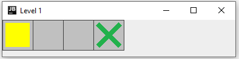
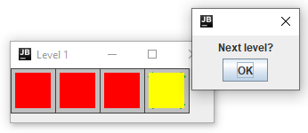
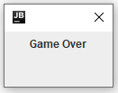
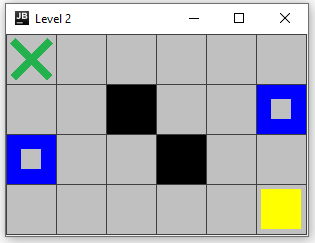
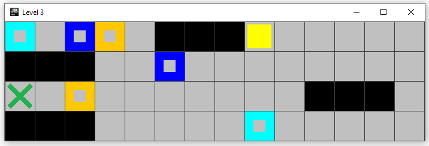
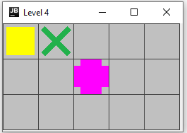

# Get It Filled

## User Guide
1. Run the **main()** method in `Engine.Java`.

2. Use the arrows to move around.

3. After filling all boxes in the board, a new window will open to ask you if you want to proceed to the next level.

4. After the last level, the following window will be shown.

## Example Levels
### Level 1

### Level 2
This level introduces the concept of portals (blue boxes) that teleport the player to the corresponding portal.

### Level 3

### Level 4
This level introduces the concept of bridges (pink box) that can be crossed more than one time. 

## Adding New Level
In order to add new levels, you can add new boards to the `boards/` folder. 
